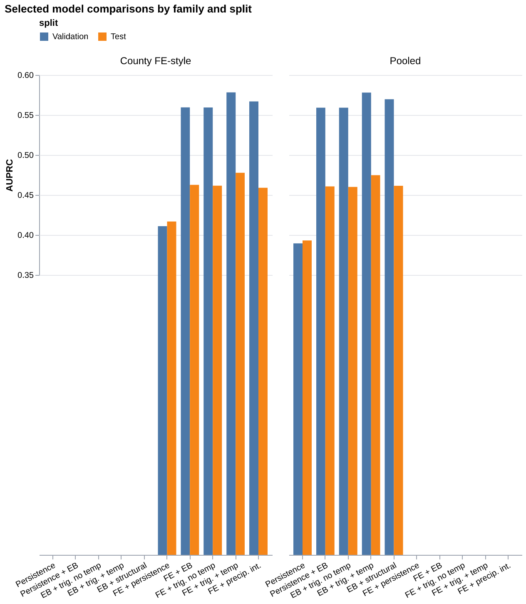
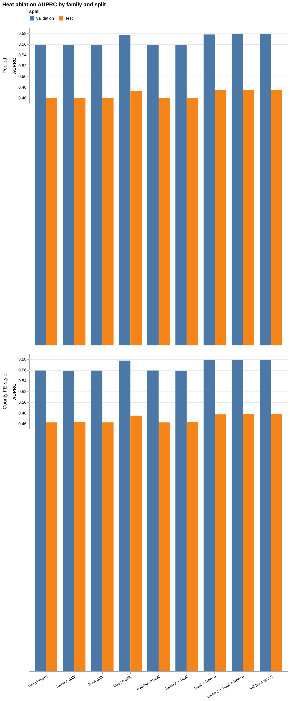

# What Texas Open Data Can and Cannot Tell Us About Next-Month Drinking-Water Risk

Generated: 2026-05-10

## Abstract

We build a reproducible Texas county-month panel from contest-relevant Texas open data, enriched with adjacent federal public environmental context, to test what an integrated open-data stack can contribute to drinking-water risk ranking. The panel links SDWIS health-based violation outcomes to Texas sewer overflows, permits, surface-water context, precipitation, flood-warning context, nearest-gauge streamflow, drought, and county-centroid temperature proxies from 2020-01 through 2025-12. It contains 18,288 county-month rows spanning 254 counties and 72 months. We evaluate pooled logistic and county fixed-effects-style predictive ladders for ranking next-month county SDWIS event occurrence. Across model families, persistent county baseline risk dominates most short-run trigger layers, and a simple empirical-Bayes county baseline materially improves ranking performance relative to persistence-only baselines. Precipitation, flood-warning, streamflow, and drought context add limited incremental value beyond the stabilized chronic baseline. Before explicit season controls, temperature-seasonality context adds the clearest improvement in both pooled and within-county-style backtests: in the full pooled trigger stack, validation AUPRC rises from 0.559 for the non-temperature EB trigger benchmark to 0.578, while test AUPRC rises from 0.460 to 0.475; in the county fixed-effects-style pass, the analogous improvement is from 0.559 to 0.578 in validation and from 0.462 to 0.478 in test. However, a month-of-year robustness pass changes the interpretation materially: adding month controls to the non-temperature benchmark raises pooled validation and test AUPRC to 0.837 and 0.692, and the analogous county fixed-effects-style model reaches 0.837 and 0.693. After those controls, `freeze_days` and the `heat_days + freeze_days` bundle retain only small residual gains. We therefore interpret the temperature result as a refined seasonality signal with modest incremental ranking value beyond broad annual timing, not as causal proof.

---

## 1. Introduction

Public drinking-water risk is often communicated through isolated incidents, system-specific enforcement actions, or after-the-fact notice events. That mode of analysis remains important, but it makes it difficult to compare places systematically or to ask whether available public signals improve short-horizon risk ranking. The Texas open-data contest framing sharpens this problem: Texas agencies expose multiple fragmented but high-value open datasets, yet there is no single integrated, reproducible workflow for identifying where next-month drinking-water stress may be elevated or where official signals appear inconsistent. Texas therefore offers a useful setting for testing what open data can and cannot do when assembled into a statewide drinking-water monitoring panel.

This paper asks a pragmatic rather than causal question: given a county-month stack built from Texas open data and adjacent federal public environmental context, which features improve ranking of **next-month** SDWIS health-based event occurrence? More specifically, do short-run trigger layers such as precipitation, flood warnings, streamflow, drought, and temperature add predictive value beyond persistent county-level baseline risk?

The resulting empirical picture is narrower and more informative than a generic “weather matters” story. Most tested trigger layers contribute only modest incremental value once persistent county risk is encoded properly. A simple empirical-Bayes county baseline provides a strong small-area stabilization device and substantially improves predictive ranking. Among the tested contextual layers, temperature-seasonality features are the first to show a clear incremental gain beyond the existing non-temperature trigger stack, but a later month-of-year robustness pass shows that broad annual seasonality itself is an even larger predictive component.

### 1.1 Questions

We focus on four questions:

1. What can a Texas open-data water-risk stack learn from contest-relevant public data alone?
2. How much predictive signal comes from persistent county baseline risk?
3. Do trigger layers improve next-month SDWIS ranking beyond that stabilized baseline?
4. Which contextual layers are most informative in a county-month public-data design?

### 1.2 Contest and open-data relevance

The thesis is motivated directly by the open-data contest setting. Its goal is not just to fit a predictive model, but to test whether contest-relevant Texas open data can be turned into a reproducible statewide water-risk ranking system. The paper therefore treats the source stack itself as part of the research contribution:

- **Texas open data** provide the core operational and environmental infrastructure layers, especially sewer overflows, permits, water districts, and surface-water context.
- **Adjacent public federal sources** provide additive enrichment for drinking-water outcomes and hydrometeorological context, especially SDWIS, streamflow, drought, and archived warnings.
- **Grassroots strip observations**, when used, are framed as a separate community validation layer rather than a replacement for the open-data backbone.

This framing matters because one of the paper's central findings is not just predictive. It is also infrastructural: some open-data layers materially improve the ranking system, while others are mainly descriptive or explanatory at county-month resolution.

### 1.3 Contributions

The paper makes four bounded contributions.

1. **Open-data systems contribution**: it assembles contest-relevant Texas open data plus adjacent public federal context into a reproducible county-month drinking-water risk panel.
2. **Method contribution**: a simple empirical-Bayes county baseline provides a strong and interpretable small-area stabilization baseline for county-month event prediction.
3. **Empirical contribution**: chronic county baseline risk and broad month-of-year seasonality dominate most short-run trigger layers, while temperature-seasonality context adds only modest residual ranking value after explicit season controls.
4. **Civic-tech contribution**: statewide open-data water-risk monitoring appears to benefit more from baseline stabilization plus selected contextual layers than from naive event-trigger stacking alone, and it creates a natural interface for later community-validation layers.

### 1.4 Non-claims

This paper does **not** claim causal identification. It does not treat county-centroid air temperature as water temperature, nor nearest-gauge streamflow as a full county hydrologic exposure measure. The results are about predictive association, ranking utility, and additive contextual interpretation.

### 1.5 Related work positioning

This project sits at the intersection of three literatures.

First, it relates to the broad literature on **water-quality prediction and drinking-water early warning**. Recent reviews emphasize that water-quality modeling often relies on richer sensor streams, laboratory measurements, distribution-system telemetry, or site-specific contaminant modeling than are available in public statewide administrative data. Reviews such as *A Comprehensive Review of Machine Learning for Water Quality Prediction over the Past Five Years* (2024) and *The Utility of Machine Learning Models for Predicting Chemical Contaminants in Drinking Water: Promises, Challenges, and Opportunities* (2022) highlight both the promise of predictive modeling and the limits imposed by sparse, noisy, or indirect measurements. The present paper is narrower. It does not attempt high-frequency water-quality forecasting. Instead, it asks what can be learned from a contest-relevant public-data stack at county-month resolution.

Second, the paper relates to **small-area estimation and empirical-Bayes risk stabilization**. In public-health and disease-mapping settings, empirical-Bayes and hierarchical methods are often used to stabilize noisy small-area rates before ranking places. Work such as *Using Empirical Bayes Methods to Rank Counties on Population Health Measures* (2013) and *Empirical Bayes Estimation of Relative Risks in Disease Mapping* (2002) is relevant here because the practical problem is similar: county-level event rates are heterogeneous, sparse, and easy to over-interpret if treated naively. Our use of an EB county baseline follows that spirit, although the application here is predictive ranking rather than formal disease mapping.

Third, the project fits within the emerging literature on **open-data environmental monitoring, screening, and community-facing decision support**. Recent reviews of environmental health and justice screening tools emphasize both the value and the fragility of integrating heterogeneous public datasets into user-facing systems. That framing is close to the present contribution. Atlas TX is not a new sensor system or a replacement for regulatory monitoring; it is an open-data integration and ranking workflow designed to test what a public statewide stack can support, where it helps, and where it remains too coarse.

Relative to those literatures, the main novelty here is not a new machine-learning architecture. It is the combination of a reproducible Texas open-data panel, a small-area stabilization baseline, and a careful comparison between chronic baseline risk, broad seasonality, and short-run contextual trigger layers in a civic-data setting.

---

## 2. Data and panel construction

### 2.1 Unit of observation

The unit of observation is the **Texas county-month**. The canonical panel spans:

- **254 counties**
- **72 months**
- **2020-01 through 2025-12**
- **18,288 rows**

The canonical persisted artifacts are:

- `data/panels/county_month_water_risk.csv`
- `data/panels/county_month_water_risk.schema.json`

### 2.2 Outcome

The main outcome is county-month SDWIS health-based burden, with the primary predictive target defined as:

- `sdwis_event_any`: whether at least one unique health-based SDWIS event occurs in the county-month

The panel also stores:

- `sdwis_event_count`
- persistence-history fields such as `sdwis_prior_1m_any`, `sdwis_prior_3m_count`, `sdwis_prior_12m_count`, and `sdwis_cumulative_prior_count`

The predictive task is to use features observed in month \(t\) to rank the probability of `sdwis_event_any` in month \(t+1\).

### 2.3 Predictor families

The panel includes five main predictor groups.

#### A. Persistence / outcome-history

These variables encode the local recent history of SDWIS event burden and serve as the baseline-to-beat.

#### B. Overflow context

County-month overflow features include incident counts, total gallons, log gallons, recent repeat activity, and severity-style indicators from the Texas overflow source.

#### C. Structural context

Current-snapshot contextual variables include:

- `permit_count_current`
- `impaired_segments_current`
- `hydrology_context_score_current`

These are treated as contextual between-county covariates rather than true monthly backfilled histories.

#### D. Weather and hydrometeorological context

The enriched panel includes:

- precipitation totals and anomalies
- NWS flood / flash-flood warning context from historical OpenFEMA IPAWS filtering
- nearest-gauge USGS streamflow anomaly-derived indicators
- U.S. Drought Monitor county-month drought fractions
- county-centroid temperature features: `temp_mean_anomaly_z`, `heat_days`, `freeze_days`

#### E. Interaction terms

The panel stores precomputed interaction features such as:

- `overflow_x_precip_anomaly`
- `overflow_x_flood_warning`
- `overflow_x_drought`
- `overflow_x_heat`
- `overflow_x_streamflow_high`
- `overflow_x_streamflow_low`

### 2.4 Data provenance and proxy structure

The panel is intentionally organized as **Texas open data at the core plus adjacent public federal context as additive enrichment**.

### Table 1. Compact source and proxy summary

| Source family | Provider | Geography / time | Role in panel | Example features | Main limitations |
|---|---|---|---|---|---|
| Drinking-water outcomes | EPA SDWIS / Envirofacts | County-month target derived from system records | Primary predictive outcome | `sdwis_event_any`, `sdwis_event_count` | Regulatory timing may not equal real-time exposure timing; county aggregation is coarse |
| Sewer overflows | Texas open data / TCEQ-linked overflow records | County-month | Core Texas operational exposure layer | `overflow_count`, `overflow_log_gallons_sum`, `overflow_repeat_3m_any` | Incident records are not equivalent to direct drinking-water contamination pathways |
| Permits / structural context | Texas state sources | Current contextual county snapshot | Between-county structural covariates | `permit_count_current` | Not fully backfilled monthly histories |
| Surface-water context | Texas state sources | Current contextual county snapshot | Environmental structural covariates | `impaired_segments_current`, `hydrology_context_score_current` | Snapshot context rather than historical monthly exposure |
| Precipitation | Open-Meteo archive | County-centroid daily to county-month | Weather trigger context | `precip_total_mm`, `precip_anomaly_z`, `heavy_rain_days` | County-centroid approximation; not polygon-weighted county exposure |
| Temperature-seasonality | Open-Meteo archive | County-centroid daily to county-month | Weather / timing refinement | `temp_mean_anomaly_z`, `heat_days`, `freeze_days` | Air temperature proxy, not direct water-system thermal stress |
| Flood warnings | OpenFEMA IPAWS archived alerts | Texas county SAME-code month counts | Hazard alert context | `flood_warning_any`, `flash_flood_warning_any` | Alert exposure is administrative and coarse; not direct impact measurement |
| Streamflow | USGS NWIS | Nearest active gauge, daily to county-month | Hydrologic context | `streamflow_high_count`, `streamflow_low_count` | Nearest-gauge approximation; incomplete coverage |
| Drought | U.S. Drought Monitor | Weekly county statistics aggregated to month | Slow-moving hydrologic context | `drought_fraction_d1plus`, `drought_fraction_d3plus` | Category fractions are coarse and slow-moving |

Several contextual layers are approximate by construction.

- Precipitation and temperature use **county-centroid Open-Meteo archive** queries.
- Streamflow uses the **nearest active USGS gauge** to each county centroid.
- Drought uses **weekly U.S. Drought Monitor county statistics** aggregated to county-month means.
- Flood-warning context comes from **historical OpenFEMA IPAWS alerts** filtered to Texas county codes.

These choices were made to create a fully reproducible statewide panel quickly, but they also define the paper’s limitation boundary: this is a county-month open-data ranking framework, not a fully spatially weighted hydrologic exposure model.

### 2.5 Coverage and usable rows

By the latest rebuild:

- all **18,288** county-month rows have precipitation, drought, and temperature context attached
- all **18,288** rows also have flood-warning context attached once the historical snapshot exists
- trigger-model usable rows remain capped at **14,698** because streamflow coverage depends on nearest-gauge assignment and historical availability

---

## 3. Methods

### 3.1 Prediction target

For each county-month row at time \(t\), we predict whether `sdwis_event_any = 1` at \(t+1\).

### 3.2 Temporal split design

The backtest uses a fixed chronological split:

- **Train**: 2020-02 through 2023-12
- **Validation**: 2024-01 through 2024-12
- **Test**: 2025-01 through 2025-12

This design preserves temporal ordering and makes the final test period a genuine forward holdout.

### 3.3 Model families

We evaluate two main model families. The first asks how far a simple statewide pooled ranking model can go. The second asks whether the same trigger layers still help after absorbing county-specific baseline propensity more explicitly.

#### Pooled ladder

This family compares progressively richer pooled logistic models:

1. prevalence baseline
2. persistence only
3. persistence + EB county baseline
4. overflow and precipitation additions
5. enriched weather-trigger stacks
6. structural-context comparison models

#### County fixed-effects-style ladder

This family uses pooled logistic models with county-specific intercepts to approximate a within-county comparison. The question here is whether trigger layers still add value after absorbing county baseline propensity more explicitly.

### 3.4 Empirical-Bayes county baseline

A central modeling device is the EB county baseline. The rationale is straightforward: county-level outcome rates are heterogeneous, and even with equal observation windows, a shrunk county baseline gives a more stable chronic-risk encoding than naive raw-rate intuition. In this panel, the EB term consistently improves ranking performance and helps separate the chronic baseline story from the short-run trigger story.

### 3.5 Metrics

We report:

- AUROC
- AUPRC
- Brier score
- precision at top decile
- lift at top decile

Because the event is relatively imbalanced and the intended use is ranking, **AUPRC** is the primary metric.

---

## 4. Results

## 4.1 Persistent county baseline risk dominates

The first and most stable result is that persistent county baseline risk is the strongest signal in the panel. The persistence-only model already substantially outperforms the prevalence baseline, and adding the EB county baseline produces another material jump.

In the pooled ladder:

- Persistence only: validation AUPRC **0.389**, test **0.393**
- Persistence + EB county baseline: validation AUPRC **0.559**, test **0.461**

In the county-FE-style ladder:

- County FE + persistence: validation AUPRC **0.411**, test **0.417**
- County FE + persistence + EB baseline: validation AUPRC **0.559**, test **0.463**

These gains are too large to treat as incidental. They indicate that chronic county heterogeneity is not a nuisance side issue; it is the main predictive component in this county-month design.

## 4.2 Most non-heat trigger layers add only modest value

Adding precipitation, flood-warning, streamflow, and drought layers improved context and interpretability, but their predictive contribution beyond the stabilized chronic baseline was modest.

For example, the pooled non-heat EB trigger stack reached:

- validation AUPRC **0.559**
- test AUPRC **0.460**

This is essentially unchanged from the simpler EB baseline model in validation and only marginally different in test. The county-FE-style non-heat benchmark shows the same pattern:

- validation AUPRC **0.559**
- test AUPRC **0.462**

The main implication is that the county-month design, at least with the current proxies, supports a stronger chronic-risk narrative than a dramatic storm-trigger narrative.

## 4.3 Temperature context adds the clearest pre-robustness incremental gain

The strongest pooled enriched model is:

**Persistence + EB baseline + overflow + precipitation + NWS flood + streamflow + drought + heat**

with:

- validation AUPRC **0.578**
- test AUPRC **0.475**

The strongest county-FE-style enriched model is:

**County FE + persistence + EB baseline + overflow + precipitation + NWS flood + streamflow + drought + heat**

with:

- validation AUPRC **0.578**
- test AUPRC **0.478**

Relative to the non-heat EB trigger benchmark, this is a meaningful gain in both validation and test. It is also the first trigger-layer addition in the weather stack to improve both model families clearly enough to change the thesis narrative.

### Table 2. Core Model Comparison Summary

| Family | Model | Validation AUPRC | Test AUPRC |
|---|---|---:|---:|
| Pooled | Persistence only | 0.389 | 0.393 |
| Pooled | Persistence + EB county baseline | 0.559 | 0.461 |
| Pooled | EB trigger stack without temperature | 0.559 | 0.460 |
| Pooled | EB trigger stack + temperature | 0.578 | 0.475 |
| Pooled | EB + structural context | 0.570 | 0.461 |
| County FE-style | FE + persistence | 0.411 | 0.417 |
| County FE-style | FE + EB baseline | 0.559 | 0.463 |
| County FE-style | FE trigger stack without temperature | 0.559 | 0.462 |
| County FE-style | FE trigger stack + temperature | 0.578 | 0.478 |
| County FE-style | FE + precipitation interaction model | 0.567 | 0.459 |

### Figure 1. Selected Model Comparisons by Family and Split

## 4.4 Heat-Focused Ablation

A dedicated heat ablation was run against the non-temperature EB trigger benchmark. Four findings matter most:

1. The gain is **not** solely an artifact of including every heat variable at once.
2. The strongest **single** added temperature-seasonality term by validation AUPRC is `freeze_days` in both pooled and county-FE-style ladders.
3. The best compact bundle is `heat_days + freeze_days`.
4. The full heat stack matches or slightly improves on the best compact bundle.

Key ablation values:

### Pooled single-term ablations
- Benchmark + `freeze_days`: validation AUPRC **0.577**, test **0.472**
- Benchmark + `heat_days`: validation AUPRC **0.558**, test **0.460**
- Benchmark + `temp_mean_anomaly_z`: validation AUPRC **0.558**, test **0.460**
- Benchmark + `overflow_x_heat`: validation AUPRC **0.558**, test **0.459**

### Pooled compact bundle
- Benchmark + `heat_days + freeze_days`: validation AUPRC **0.578**, test **0.475**

### County-FE-style single-term ablations
- Benchmark + `freeze_days`: validation AUPRC **0.577**, test **0.475**
- Benchmark + `heat_days`: validation AUPRC **0.559**, test **0.463**
- Benchmark + `temp_mean_anomaly_z`: validation AUPRC **0.558**, test **0.463**
- Benchmark + `overflow_x_heat`: validation AUPRC **0.559**, test **0.462**

### County-FE-style compact bundle
- Benchmark + `heat_days + freeze_days`: validation AUPRC **0.578**, test **0.478**

This ablation sharpens the wording of the result. The paper should not claim merely that “hot days” explain the gain. A more accurate description is that **temperature-seasonality context**, especially the `freeze_days` term and the `heat_days + freeze_days` bundle, carries measurable incremental ranking value before explicit season controls are added.

### Table 3. Heat Ablation Summary

| Family | Ablation model | Validation AUPRC | Test AUPRC |
|---|---|---:|---:|
| Pooled | Benchmark: non-heat EB trigger stack | 0.559 | 0.460 |
| Pooled | + `freeze_days` | 0.577 | 0.472 |
| Pooled | + `heat_days + freeze_days` | 0.578 | 0.475 |
| Pooled | + full heat stack | 0.578 | 0.475 |
| County FE-style | Benchmark: non-heat EB trigger stack | 0.559 | 0.462 |
| County FE-style | + `freeze_days` | 0.577 | 0.475 |
| County FE-style | + `heat_days + freeze_days` | 0.578 | 0.478 |
| County FE-style | + full heat stack | 0.578 | 0.478 |

### Figure 2. Heat Ablation AUPRC by Family and Split

## 4.5 Structural context comparison

A structural-context EB model without the enriched trigger stack reaches:

- validation AUPRC **0.570**
- test **0.461**

This remains strong, but the heat-enriched trigger stack now surpasses it in validation and test. That matters because it shows the thesis does not reduce entirely to “baseline risk plus static structure.” The temperature-seasonality layer is now empirically competitive enough to deserve real attention.

## 4.6 Month-of-year seasonality robustness

A direct reviewer concern is that the temperature result may mostly reflect generic annual timing rather than more specific thermal context. To test that possibility, we reran the non-temperature EB trigger benchmark with explicit month-of-year indicator controls and then added compact temperature terms back on top.

The robustness pass changes the interpretation materially.

### Pooled month-control comparison
- Benchmark without month controls: validation AUPRC **0.559**, test **0.460**
- Benchmark + month-of-year controls: validation **0.837**, test **0.692**
- Benchmark + month-of-year controls + `freeze_days`: validation **0.838**, test **0.695**
- Benchmark + month-of-year controls + `heat_days + freeze_days`: validation **0.838**, test **0.695**
- Benchmark + month-of-year controls + full temperature stack: validation **0.839**, test **0.695**

### County fixed-effects-style month-control comparison
- Benchmark without month controls: validation AUPRC **0.559**, test **0.462**
- Benchmark + month-of-year controls: validation **0.837**, test **0.693**
- Benchmark + month-of-year controls + `freeze_days`: validation **0.839**, test **0.697**
- Benchmark + month-of-year controls + `heat_days + freeze_days`: validation **0.839**, test **0.697**
- Benchmark + month-of-year controls + full temperature stack: validation **0.840**, test **0.697**

Two conclusions follow.

1. **Broad month-of-year seasonality is itself a major predictive component in this county-month design.** Its effect is much larger than the earlier incremental gain from adding temperature features to the unconstrained benchmark.
2. **Compact temperature-seasonality terms still retain small residual value after those controls.** The gains are real but modest: on the order of roughly 0.001 to 0.004 AUPRC rather than the earlier 0.016 to 0.019 improvements seen before explicit month controls.

This robustness pass therefore weakens the stronger version of the thermal thesis. The reviewer-safe interpretation is not that temperature variables reveal a large new trigger layer, but that broad annual timing matters a great deal and compact thermal count variables provide a small additional refinement beyond that timing baseline.

---

## 5. Discussion

## 5.1 Main interpretation

The clearest reading of the results is that county-month drinking-water risk ranking from public/open data is dominated by persistent baseline heterogeneity and that simple small-area stabilization is crucial. Once we add an explicit month-of-year robustness pass, it is also clear that broad annual seasonality is a major predictive component in its own right. Most contextual weather layers do not overwhelm that chronic-risk structure.

This is a stronger and more defensible contribution than a looser story about generic weather influence. The panel shows that many intuitively plausible open-data trigger layers either add little at this resolution or are already partially absorbed by persistent county differences and broad seasonal timing. That negative result is informative for the contest/open-data framing: it tells us not just how to predict better, but which public layers mainly encode chronic structure, which capture broad seasonality, and which provide only smaller residual refinements to the ranking system.

## 5.2 Why temperature-seasonality may matter more than the other triggers

Several interpretations are plausible.

1. **Broad annual timing dominates first**: the month-of-year robustness pass shows that generic seasonal timing is itself a major predictor.
2. **Operational stress refinement**: conditional on that broad timing, temperature-seasonality variables may still track treatment and system stress better than monthly precipitation totals do.
3. **Seasonal source-water quality dynamics**: thermal conditions may co-move with source-water characteristics that are not directly measured in the panel.
4. **Seasonal infrastructure vulnerability**: freeze-day and hot-day counts may proxy vulnerability windows better than drought category or streamflow anomaly alone.
5. **Better timing proxy**: count-based temperature variables may align more closely with operational conditions than monthly mean anomalies or event-warning counts.

The current evidence does not distinguish among these mechanisms causally. The strongest safe read is therefore layered: month-of-year timing explains a large share of the predictive gain, while `freeze_days` and the `heat_days + freeze_days` bundle appear to add a smaller residual refinement beyond that timing baseline. That suggests count-based thermal stress windows may still be more useful than smooth anomaly summaries in this design, but the effect is narrower than the pre-robustness result alone suggested.

## 5.3 Why the county-month panel still matters

The county-month unit is coarse, but it remains analytically useful for three reasons.

1. It permits statewide reproducible ranking from public data.
2. It is sufficient to reveal the chronic-baseline-versus-trigger tradeoff.
3. It creates a practical bridge to a stronger future PWS-month design.

The fact that temperature-seasonality context still helps at this coarse level strengthens the case for testing finer-resolution system-month models later.

---

## 6. Threats to Validity and Limitations

The main limitations should be foregrounded explicitly. A contest-facing version of the paper should also make clear that open-data integration strength and predictive utility are not the same thing: some datasets are valuable because they improve ranking, while others are valuable because they improve interpretability, provenance, or investigative follow-up.

### 6.1 Measurement and proxy validity

- County-centroid precipitation and temperature are not polygon-weighted county exposure estimates.
- Nearest-gauge streamflow is a pragmatic approximation, not a full hydrologic representation.
- Temperature-seasonality terms are contextual proxies rather than direct measurements of water-system thermal stress.
- Flood-warning and drought layers are administrative or category-based summaries rather than direct physical exposure measurements.

### 6.2 Temporal validity

- County-month may obscure event timing and system-specific operational windows.
- SDWIS dates reflect regulatory record timing rather than perfect real-time exposure timing.
- Month-of-year controls reveal that broad seasonality is a major component, so pre-control temperature gains should not be interpreted as uniquely thermal effects.

### 6.3 Model-specification validity

- The county fixed-effects-style model is an approximation using county-specific intercepts rather than a full hierarchical or conditional-logit implementation.
- EB stabilization improves prediction, but it does not solve all heterogeneity concerns.
- The month-control robustness pass pressure-tests one important objection, but it does not exhaust all possible alternative seasonal specifications.

### 6.4 Interpretive validity

- Results are predictive, not causal.
- A positive predictive signal for temperature context does not imply that temperature is the sole or even primary physical mechanism behind violations.
- Strong performance from chronic baseline risk and month-of-year timing does not by itself identify the institutional, infrastructural, or environmental drivers underneath those patterns.

### 6.5 External-validity limits

- The current design is specific to Texas open-data conditions and may not transfer directly to states with different reporting practices.
- County-month ranking is a screening layer, not a substitute for PWS-level operational monitoring or causal investigation.

---

## 7. Conclusion

This paper presents a reproducible Texas county-month panel for ranking next-month SDWIS health-based event risk from contest-relevant open data plus adjacent public federal environmental context. Its main empirical result is that **persistent county baseline risk dominates most short-run trigger layers**, and that a simple **empirical-Bayes county baseline** materially improves ranking performance. Precipitation, flood-warning, streamflow, and drought context add limited value beyond that stabilized baseline. A seasonality robustness pass further shows that **broad month-of-year timing is itself a major predictor**. Temperature-seasonality context still adds a smaller residual gain, with heat-focused ablations and month-control tests pointing most consistently to `freeze_days` and the `heat_days + freeze_days` bundle.

The contribution is therefore best framed as open-data systems, predictive, and methodological at the same time. A practical statewide water-risk ranking pipeline can be built from public/open data, but not all open-data layers contribute equally: some mainly encode chronic structure, some capture broad annual timing, some mainly improve interpretation, and only a smaller subset materially improves holdout ranking performance beyond those stronger baselines. The next research step should be either a formal partial-pooling county model or a finer-resolution PWS-month design, followed by a separate grassroots validation layer for testing where open-data ranking and community-observed anomalies align or diverge.

---

## 8. Tables and Figures for the Next Draft

### Core tables
1. Panel coverage table
2. Pooled model ladder table
3. County-FE-style ladder table
4. Heat ablation table

Tables 2 and 3 in this draft provide compact summary versions of the model-comparison and heat-ablation results. Table 1 summarizes the source and proxy stack. Full detailed ladders remain in the saved output artifacts.

### Core figures
1. Panel construction diagram
2. Validation AUPRC comparison across models
3. Validation versus test AUPRC for the enriched trigger stacks
4. Optional EB baseline / county heterogeneity figure

Figures already generated in this draft pass:
- Figure 1: `outputs/figures/model-comparison-selected.png`
- Figure 2: `outputs/figures/heat-ablation-auprc.png`

---

## Sources

- Open-Meteo Historical Weather API  
  https://open-meteo.com/en/docs/historical-weather-api
- Open-Meteo historical weather OpenAPI spec  
  https://github.com/open-meteo/open-meteo/blob/main/openapi_historical_weather_api.yml
- U.S. Drought Monitor web service docs  
  https://droughtmonitor.unl.edu/DmData/DataDownload/WebServiceInfo.aspx
- USGS Water Services overview  
  https://www.usgs.gov/tools/usgs-water-services
- OpenFEMA IPAWS Archived Alerts  
  https://www.fema.gov/openfema-data-page/ipaws-archived-alerts-v1
- Texas Open Data portal  
  https://data.texas.gov/
- Atlas TX pooled model ladder artifact  
  file:///home/stathis/atlas-tx/outputs/model-results/2026-05-09-precipitation-aware-model-ladder.md
- Atlas TX county-FE model ladder artifact  
  file:///home/stathis/atlas-tx/outputs/model-results/2026-05-09-fixed-effects-precipitation-backtest.md
- Atlas TX heat ablation artifact  
  file:///home/stathis/atlas-tx/outputs/thesis-status/2026-05-09-heat-ablation-memo.md
- Atlas TX seasonality robustness artifact  
  file:///home/stathis/atlas-tx/outputs/thesis-status/2026-05-10-seasonality-robustness-memo.md
- Atlas TX panel coverage artifact  
  file:///home/stathis/atlas-tx/outputs/panel-summary/county-month-water-risk-coverage.md
- A Comprehensive Review of Machine Learning for Water Quality Prediction over the Past Five Years (2024)  
  https://www.mdpi.com/2077-1312/12/1/159
- The Utility of Machine Learning Models for Predicting Chemical Contaminants in Drinking Water: Promises, Challenges, and Opportunities (2022)  
  https://link.springer.com/content/pdf/10.1007/s40572-022-00389-x.pdf?error=cookies_not_supported&code=cca7727a-d963-410a-a271-5c522d35c7b6
- Using Empirical Bayes Methods to Rank Counties on Population Health Measures (2013)  
  https://www.cdc.gov/pcd/issues/2013/13_0028.htm
- Empirical Bayes Estimation of Relative Risks in Disease Mapping (2002)  
  https://journals.sagepub.com/doi/10.1177/0008068320020304
- Environmental Health and Justice Screening Tools: A Critical Examination and Path Forward (2024)  
  https://public-pages-files-2025.frontiersin.org/journals/environmental-health/articles/10.3389/fenvh.2024.1427495/pdf
- Citizen and Community Science Data in Exposure and Environmental Health Research and Practice: A Narrative Review (2021)  
  https://www.frontiersin.org/articles/10.3389/fsufs.2021.620470/pdf
